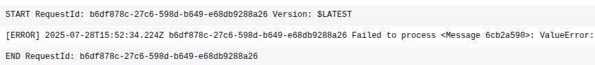

# Queue Tea Pie

QTP is a python package library that aims to simplify and streamline
the creation of AWS Lambdas that take requests from SQS queues (hence the name).

## Installation
To install the latest stable version of QTP, you may run the following command:
```shell
pip install aws-qtp
```

## Using QTP
### Simple example
The following example is a fully working usage of QTP:
```python
from qtp import sqs_handler
from qtp.models import SQSEventRecord


@sqs_handler
def lambda_handler(record: SQSEventRecord) -> None:
    # Individual messages can be processed here.
    # This function will be called for all messages
    # passed onto the lambda.
    print(record.body)
    
    if record.body == "this is an error":
        # errors automatically cause the record to
        # fail, meaning they'll be added back into the queue
        raise ValueError("Error found!")
```
The lambda function would produce the following logs with a message containing the text "this is an error":



Whilst the error we raised appears correctly in the CloudWatch console, this doesn't cause
the program to exit, meaning other messages can still be processed by the lambda function.

### Error handling
Since the previous message has failed to process, it will land right back in the queue in
order to be processed again.
However, you might want to prevent the message from getting back into the queue, or you
might want to perform some cleanup actions before the message gets back into the queue.

As such, in order to allow users to define what to do when a message fails, a ``cleanup``
function can be defined to do just that:
```python
from qtp import sqs_handler
from qtp.models import SQSEventRecord


@sqs_handler
def lambda_handler(record: SQSEventRecord) -> None:
    print(record.body)
    
    if record.body == "this is an error":
        raise ValueError("Error found!")

@lambda_handler.cleanup
def lambda_handler(record: SQSEventRecord, error: Exception) -> bool | None:
    print(f"Error that was raised: {error}")
    if record.body == "this is an error":
        return True  # don't add message/record back to queue

    # returning nothing is equivalent to returning False
    # Returning a falsy value means the record is automatically
    # added back into the queue
```
*If you've used Python's builtin ``property`` decorator, you should be familiar with how the QTP ``sqs_handler`` works.*

### Custom Behaviour
If you wish to further customize the behaviour of the SQS handler,
you can use the ``SQSEventHandler`` class.

Let's first do what we did above using the ``SQSEventHandler`` class
instead of using the provided ``sqs_handler`` decorator:
```python
from qtp import SQSEventHandler
from qtp.models import SQSEventRecord


class MySQSHandler(SQSEventHandler):
    def process_record(self, record: SQSEventRecord) -> None:
        print(record.body)
    
        if record.body == "this is an error":
            raise ValueError("Error found!")
    
    def cleanup_record(self, record: SQSEventRecord, error: Exception) -> bool | None:
        print(f"Error that was raised: {error}")
        return record.body == "this is an error"


def lambda_handler(event: dict, context: object) -> dict:
    handler = MySQSHandler(event)

    handler.process_records()  # process all records

    return handler.response()  # generated a response containing the failed records
```

Let's add some custom behaviour by passing information about
the record to the cleanup method:
```python
from qtp import SQSEventHandler
from qtp.models import SQSEventRecord


class MySQSHandler(SQSEventHandler):
    def process_record(self, record: SQSEventRecord) -> None:
        print(record.body)
    
        if record.body == "this is an error":
            self.record_data = "not cool :("
            raise ValueError("Error found!")
    
    def cleanup_record(self, record: SQSEventRecord, error: Exception) -> bool | None:
        print(f"Error that was raised: {error}")
        return self.record_data == "not cool :("


def lambda_handler(event: dict, context: object) -> dict:
    handler = MySQSHandler(event)
    handler.process_records()
    return handler.response()
```

The ``record_data`` property is a special property that resets to ``None`` every time
a new record is being processed. It also has the property of being strictly read-only
outside the ``process_record`` method, meaning you can't accidentally override it
somewhere else.
